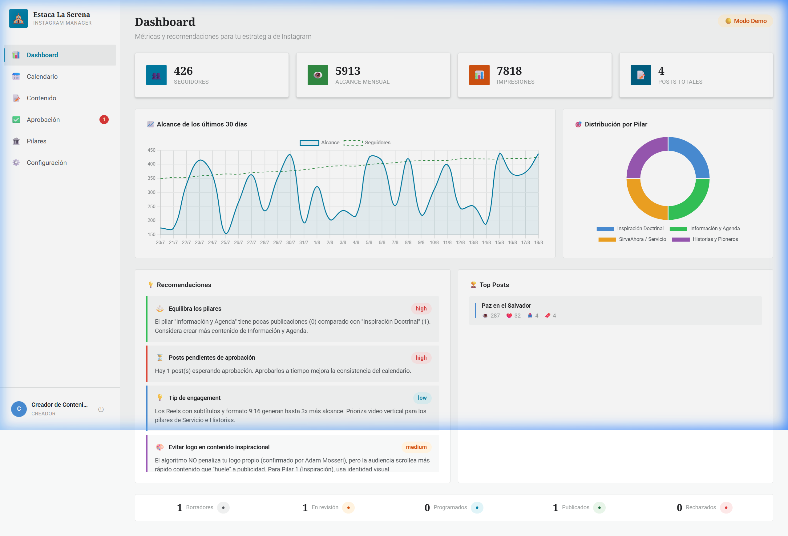
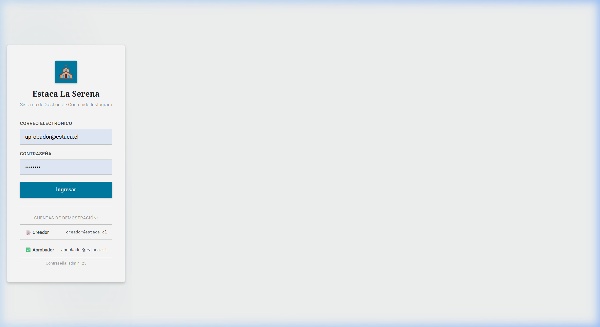
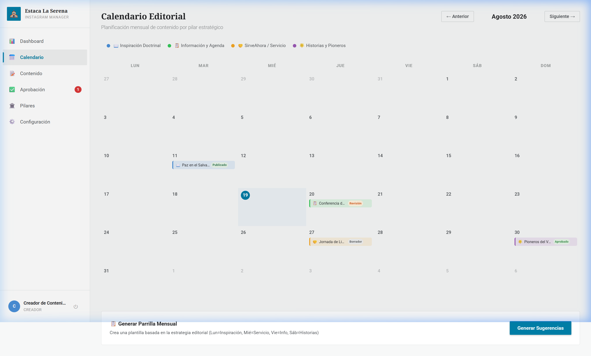
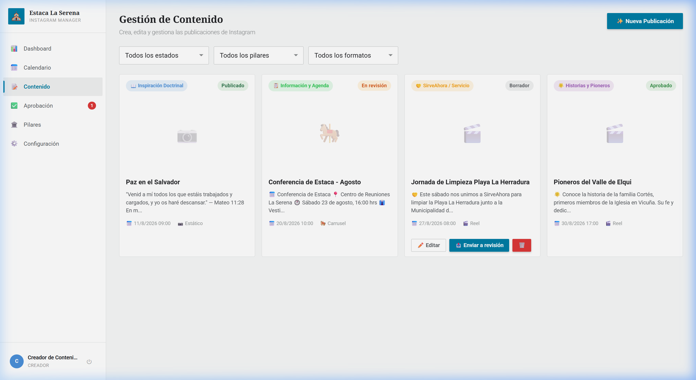
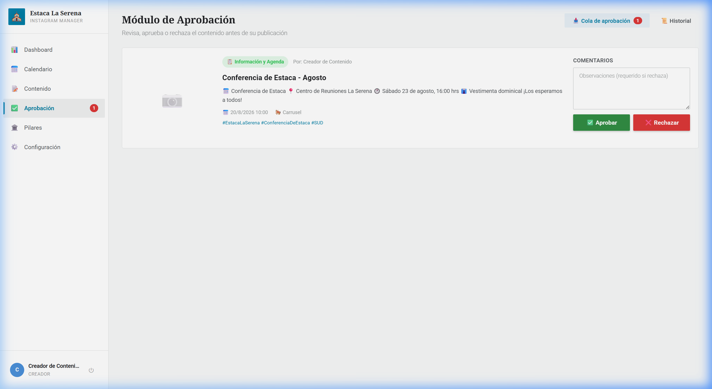
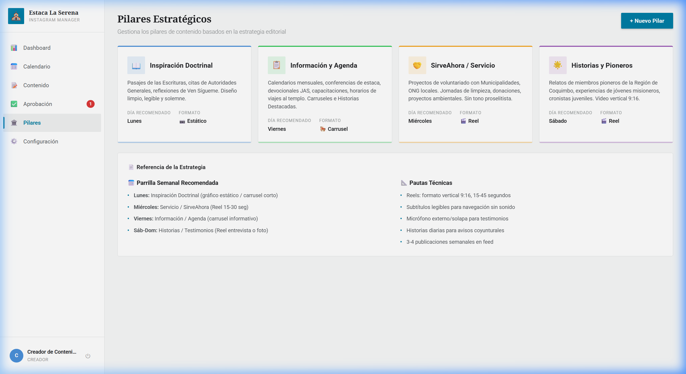
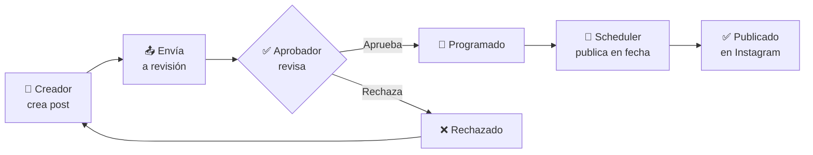

<p align="center">
  
</p>

<h1 align="center">📱 Gestión de Contenido Instagram<br/>Estaca La Serena</h1>

<p align="center">
  Sistema de gestión, aprobación y publicación de contenido para la cuenta de Instagram de la Estaca La Serena — La Iglesia de Jesucristo de los Santos de los Últimos Días.
</p>

<p align="center">
  
  
  
  
  
</p>

---

## ✨ Características

| Módulo | Descripción |
|---|---|
| 📊 **Dashboard** | Métricas en tiempo real, gráficos de alcance/seguidores, distribución por pilar y motor de recomendaciones inteligentes |
| 📅 **Calendario Editorial** | Vista mensual con código de colores por pilar. Generación automática de parrilla semanal según la estrategia |
| 📝 **Gestor de Contenido** | CRUD completo con upload de imagen/video, vista previa tipo Instagram y checklist normativo de 10 ítems |
| ✅ **Aprobación** | Flujo Creador → Aprobador con comentarios obligatorios e historial de decisiones |
| 🏛️ **Pilares Estratégicos** | 4 pilares precargados del PDF de estrategia con CRUD para personalizar |
| 🤖 **Publicación Automática** | Scheduler con `node-cron` + integración Meta Graph API para publicar automáticamente posts aprobados |
| 📋 **Guía de Branding** | Sistema inteligente que muestra guías contextuales sobre uso de logo según el pilar seleccionado |

---

## 📸 Capturas de Pantalla

### Login
<p align="center">
  
</p>

### Dashboard — Métricas y Recomendaciones
<p align="center">
  
</p>

### Calendario Editorial
<p align="center">
  
</p>

### Gestor de Contenido
<p align="center">
  
</p>

### Módulo de Aprobación
<p align="center">
  
</p>

### Pilares Estratégicos
<p align="center">
  
</p>

---

## 🚀 Inicio Rápido

### Prerrequisitos

- [Node.js](https://nodejs.org/) v18 o superior
- npm v9 o superior

### Instalación

```bash
# Clonar el repositorio
git clone https://github.com/creigthonleegarcia/gestion-contenido-ig-estaca-sud.git
cd gestion-contenido-ig-estaca-sud

# Instalar dependencias
npm install
```

### Ejecutar en desarrollo

```bash
# Terminal 1: Servidor backend (API + Base de datos + Scheduler)
npm run server

# Terminal 2: Frontend (Vite dev server)
npm run dev
```

| Servicio | URL |
|---|---|
| 🖥️ Frontend | http://localhost:5173 |
| 🔌 API Backend | http://localhost:3001/api |

### Cuentas de Demostración

El sistema crea automáticamente dos usuarios de prueba al iniciar:

| Rol | Email | Contraseña |
|---|---|---|
| 📝 Creador de Contenido | `creador@estaca.cl` | `admin123` |
| ✅ Aprobador (Pdte. Estaca) | `aprobador@estaca.cl` | `admin123` |

---

## 🏗️ Arquitectura

```
├── server/                    # Backend Node.js + Express
│   ├── index.js               # Entry point del servidor
│   ├── db.js                  # Configuración SQLite + migraciones
│   ├── seed.js                # Datos iniciales (usuarios, pilares)
│   ├── middleware/
│   │   └── auth.js            # JWT + control de roles
│   ├── routes/
│   │   ├── auth.js            # Login / registro
│   │   ├── posts.js           # CRUD de publicaciones
│   │   ├── approval.js        # Cola de aprobación
│   │   ├── calendar.js        # Calendario editorial
│   │   ├── insights.js        # Métricas + recomendaciones
│   │   ├── pillars.js         # CRUD de pilares
│   │   └── publish.js         # Integración Meta Graph API
│   └── services/
│       └── scheduler.js       # node-cron para auto-publicación
│
├── src/                       # Frontend Vue 3
│   ├── App.vue                # Layout principal con sidebar
│   ├── main.js                # Bootstrap de la app
│   ├── router/index.js        # Rutas protegidas
│   ├── stores/                # Pinia stores
│   │   ├── auth.js            # Autenticación
│   │   └── index.js           # Posts, Pilares, Insights, Calendar, Approval
│   ├── views/
│   │   ├── LoginView.vue      # Pantalla de acceso
│   │   ├── DashboardView.vue  # Métricas y gráficos
│   │   ├── CalendarView.vue   # Calendario editorial mensual
│   │   ├── ContentView.vue    # Listado de publicaciones
│   │   ├── PostFormView.vue   # Crear/editar publicación
│   │   ├── ApprovalView.vue   # Cola de aprobación
│   │   ├── PillarsView.vue    # Pilares estratégicos
│   │   └── SettingsView.vue   # Configuración Meta API
│   └── assets/styles/
│       ├── variables.css      # Design tokens (Unity Design System)
│       └── base.css           # Estilos base globales
│
├── data/                      # Base de datos SQLite (auto-generada)
├── uploads/                   # Media subida por usuarios
├── docs/                      # Documentación y assets
│   ├── Estrategia IG *.pdf    # PDF de estrategia editorial
│   ├── Logos/                 # Conceptos de logo
│   ├── Pilar1_Inspiracion/    # Material de ejemplo
│   └── screenshots/           # Capturas para README
└── .env                       # Variables de entorno (no versionado)
```

---

## 🔄 Flujo de Trabajo



### Estados de un Post

| Estado | Descripción |
|---|---|
| `borrador` | Creado pero no enviado a revisión |
| `en_revisión` | Enviado al aprobador, pendiente de decisión |
| `aprobado` | Aprobado por el Pdte. de Estaca |
| `programado` | Aprobado + fecha de publicación asignada |
| `publicado` | Publicado en Instagram (automático o manual) |
| `rechazado` | Rechazado con comentarios para corrección |

---

## 🏛️ Pilares Estratégicos

Basados en el [PDF de Estrategia Editorial](docs/Estrategia%20Instagram%20Estaca%20La%20Serena%20(1).pdf):

| Pilar | Color | Día Sugerido | Formato | Contenido |
|---|---|---|---|---|
| 💙 **Inspiración Doctrinal** | Azul | Lunes | Gráfico / Carrusel | Escrituras, citas de líderes, mensajes de fe |
| 📋 **Información y Agenda** | Verde | Viernes | Carrusel informativo | Eventos, carteleras, anuncios de la estaca |
| 🤝 **SirveAhora / Servicio** | Naranja | Miércoles | Reel 15-30s | Proyectos comunitarios, servicio al prójimo |
| 📖 **Historias y Pioneros** | Morado | Sáb-Dom | Reel / Foto | Testimonios, historias de miembros, legado |

> ⚠️ **Nota sobre branding:** El contenido del Pilar Inspiración funciona mejor **sin logo prominente**. El sistema muestra guías contextuales sobre cuándo usar o no el logo según el pilar seleccionado.

---

## 🔧 Configuración de Meta Graph API

Para habilitar la publicación real en Instagram:

### 1. Preparar la cuenta

- Convertir la cuenta de Instagram a **Business** o **Creator**
- Vincular a una **Facebook Page**

### 2. Crear app en Meta

1. Ir a [Meta for Developers](https://developers.facebook.com/)
2. Crear una nueva app tipo **Business**
3. Agregar el producto **Instagram Graph API**
4. Solicitar permisos:
   - `instagram_basic`
   - `instagram_content_publish`
   - `pages_show_list`

### 3. Configurar variables de entorno

Crear un archivo `.env` en la raíz del proyecto:

```env
PORT=3001
JWT_SECRET=una_clave_secreta_segura
META_ACCESS_TOKEN=tu_token_de_acceso_de_meta
IG_BUSINESS_ACCOUNT_ID=tu_id_de_cuenta_ig_business
```

> 💡 Sin estas variables, el sistema funciona en **modo demo** — simula la publicación sin conectar realmente a Instagram.

---

## 🎨 Sistema de Diseño

La interfaz está basada en el **Unity Design System** de [churchofjesuschrist.org](https://www.churchofjesuschrist.org):

| Aspecto | Implementación |
|---|---|
| **Modo** | Light (fondo `#f7f8f8`, cards `#ffffff`) |
| **Tipografía títulos** | Noto Serif 700 |
| **Tipografía body** | Roboto 400 |
| **Acento primario** | `#007da5` (azul institucional) |
| **Border radius** | 2-4px (sobrio, institucional) |
| **Elevación** | Escala Unity: raised → detached → overlaid |
| **Interacciones** | Feedback táctil `:active:scale(0.97)` |

---

## 📦 Stack Tecnológico

| Capa | Tecnología | Versión |
|---|---|---|
| Frontend | Vue 3 (Composition API) | 3.5+ |
| Bundler | Vite | 8.2 |
| State | Pinia | 3.x |
| Charts | Chart.js | 4.x |
| Backend | Express | 4.x |
| Base de datos | better-sqlite3 | 11.x |
| Autenticación | jsonwebtoken | 9.x |
| Scheduler | node-cron | 3.x |
| Upload | multer | 1.x |
| API | Meta Graph API | v22.0 |

---

## 📄 Licencia

Proyecto interno de La Iglesia de Jesucristo de los Santos de los Últimos Días — Estaca La Serena, Chile.

---

<p align="center">
  Desarrollado con ❤️ para la Estaca La Serena
</p>
